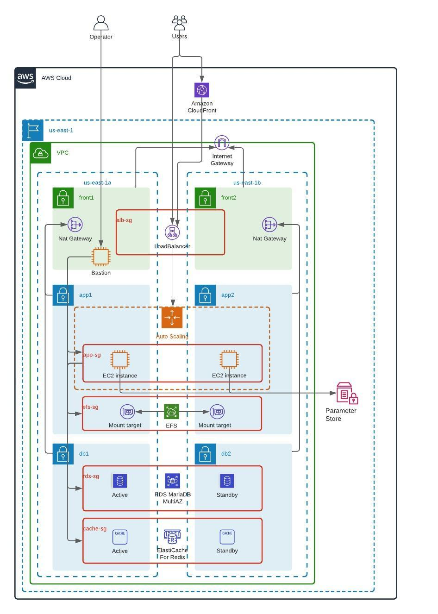

# This directory contains Architecture proposal and Terraform code to provision a Magento based web portal in AWS

## Abstract
The solution focuses on making the insfrastructure scalable, providing High Availability within an AWS Region.  Encryption, Monitoring, Logging, Alerting, Backup, and Disaster Recovery procedures haven't been considered in the solution. The installation of Magento application is made as simple as possible.


## Architecture

It follows classical 3-tier setup for a web application. Resources are distributed across 2 Availability Zones to provide High Availability. Application deployed to EC2 instances managed by Autoscaling Group which provide options to scale out to handle the load when needed. MariaDB instance is provisioned with Multi-AZ option enabled and the application cache backed up by master/replica installation of Redis with automatic failover to ensure High Availability. To reduce latency of the web application CDN is introduced to serve static content and Magento Page/General caches are powered by Redis.

The components:
* An L7 Load Balancer proxying http requests to application instances.
* CDN serving static content.
* Compute instances hosting Magento applications.
* An NFS filesystem to share content among application instances.
* Active/Standby installation of Redis hosting application cache and session storage.
* Active/Standby installation of MariaDB providing to application a database service.



## IaC templates

The described architecture is implemented using Terraform v0.13. Terraform state is stored locally.

### Prerequisites:

* Terraform 0.13.
* Configured access to an AWS account. It is assumed that full admin access is granted to AWS account.
* Authentication keys to retrieve Magento packages. Can be obtained [here](https://devdocs.magento.com/guides/v2.4/install-gde/prereq/connect-auth.html)

Please check the [default variables](terraform.tfvars) and adjust it if needed. If you want to connect to the bastion or/and application instance please copy the public part of your ssh key to `ec2_public_key` variable.


### Running:

To review changes:

```sh
terraform plan
```

To apply changes:

```sh
terraform apply -auto-approve
```
You will be asked to provide authentication keys for the Magento package repository and a ssh public key to access EC2 instances.
The command ends up with displaying endpoints, one of them, `lb_dns_name` will contain a dns name of the Application Load Balancer serving requests to Magento web application.

To destroy resources:

```sh
terraform destroy -auto-approve
```

Notes: If you you to reinstall application from scratch, please delete the following parameters, which are not managed by Terraform code. Basically they are used by `user-data` installing Magento.

* /magento/env-php
* /magento/installation-progress

```sh
    aws ssm delete-parameter --region ${aws_region} --name "/magento/env-php"
    aws ssm delete-parameter --region ${aws_region} --name "/magento/installation-progress"
```


### Resources:

* A CloudFront distribution serving static content.
* An EFS instance storing shared files.
* Parameter Store objects containing Magento configuration parameters.
* A VPC
  * Internet Gateway.
  * A public route table with the Internet Gateway serving the default route. Public subnets associated with the route table.
  * A private route table with application subnets associated. The default route is served by a Nat Gateway.
  * A private route table with database subnets associated. The default route is served by a Nat Gateway.
  * Resources in public subnets:
    * A subnet per Availability Zone.
    * An Application Load Balancer proxying the traffic to application instances.
    * A Security Group for LoadBalancer allowing incoming HTTP traffic from the Internet and outgoing traffic to application instances.
    * A Nat Gateway per Availability Zone that provides access to the internet to resources from private networks within the same Availability Zone.
    * An Autoscaling Group for Bastion host to troubleshoot application and infrastructure issues, deployed to a public subnet.
  * Resources in application private subnets:
    * An application private subnet per Availability Zone.
    * An Autoscaling Group to launch EC2 instances that host Magento application.
    * A Security Group allowing HTTP traffic from the Load Balancer and all traffic from a bastion host to application instances.
    * A EFS mount target per Availability zone.
    * A Security Group allowing NFS traffic from application instances and all traffic from a bastion host to the EFS.
  * Resources in database private subnets:
    * An database private subnet per Availability Zone.
    * A Multi-AZ instance of MariaDB RDS
    * A Security Group allowing MySQL traffic from application instances and all traffic from a bastion host to the RDS.
    * A Redis installation consisting of the primary and one replica instances with automatic failover.
    * A Security Group allowing Redis traffic from application instances and all traffic from a bastion host to the Redis.

### Notes about installation of Magento software.
The installation of Magento is described in ASG [user-data](templates/app_user_data.sh).

One of the node is supposed to be main one, it will provision a Database, create a configuration file and stores it into AWS Parameter Store, from where it will be consumed by other nodes. Only when the main node completes its bootstraping all other can start to install Magento and retrieve configuration file from the parameter store. The installation is far from being ideal, the goal is to get working instance of Magento.

## Used resources:
* [Install Magento using Composer](https://devdocs.magento.com/guides/v2.4/install-gde/composer.html)
* [Configuration Guide](https://devdocs.magento.com/guides/v2.4/config-guide/bk-config-guide.html)
