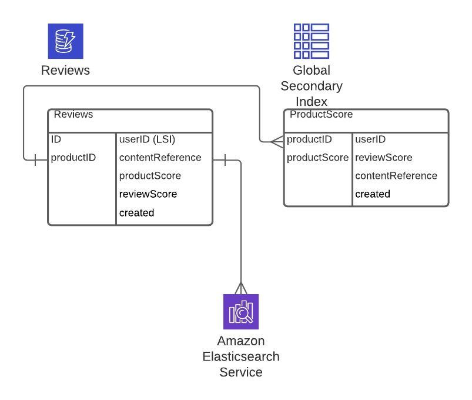
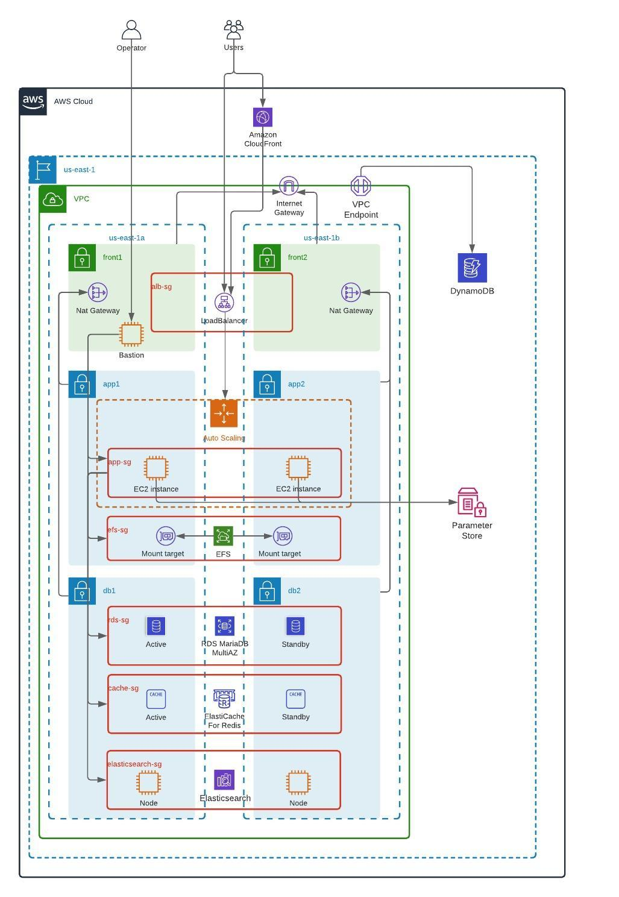

# This directory contains architecture proposal for the Customer review feature

## Abstract

The goal is to design architecture proposal for the customer review feature.

The possible requirements for the feature might be:

* A database to store objects and their relations: users, products, review content, scores for different qualities.
* A database engine providing full-text search capability to do some analytics on reviews.

For the first requirement there might be the next options:

* Relational database:
  * Relevant advantages:
    * good built-in engine capability to handle relations.
    * there is an already provisioned database containing product and user objects.
    * has full-text search capability.
  * Relevant disadvantages:
    * Not good at scaling out. Usually works in Active/StandBy or Master/Replica modes
    * Using the same database as for main Magento portal can impact performance and reduce flexibility.
    * Using an additional database will require extra work to manage dependency.

* NoSQL database:
  * Relevant advantages:
    * Has good scaling out capabilities.
    * Performance on read operations is better than for relational databases.
  * Relevant disadvantages:
    * Managing relations is limited.

Assuming that the load is expected to grow, the recommendation is to utilise AWS DynamoDB NoSQL database to store review objects. The drawback that the extra coding is required to connect Magento DB users/products related objects with the reviews objects stored in DynamoDB.
As for full-text search engine AWS Elasticsearch can be used.

## Architecture

For the sake of simplcity the solution contains one table providing ability to store review and make simple queries like getting total score for a particular product or find all review left by a particular user.

There is a DynamoDB table `Reviews` which has following structure:

* ID - an unique review identificator (Primary Key)
* productID - an product identificator (Sort Key), using it a sort key allows us to query table and possible Global Secondary indices for product specific information like, total number of reviews, total scores.
* userID - an user identificator.
* contentReference - a reference to an Elasticsearch document containing review content.
* productScore - a score for a product.
* reviewScore - a score for a review.
* created - a timestamp describing when a review was added.

The table has Local Secondary Index (UserId, ID), which allows to query information for a particular user.
There is a Global Secondary Index (productID, productScore), which allows to quickly calculate total score for a particular product.

### Database scheme



### Infrastructure diagram

The setup from the Task 1 is used. 
The application will connect to DynamoDB using VPC endpoints and Elasticsearch 2-node cluster will be deployed to private db subnets.




## IaC templates

The described architecture is implemented using Terraform v0.13. Terraform state is stored locally.

### Prerequisites:

* Terraform 0.13.
* Configured access to an AWS account. It is assumed that full admin access is granted to AWS account.
* The code uses the remote state from the Task 1.

Please check the [default variables](terraform.tfvars) and adjust it if needed.


### Running:

To review changes:

```sh
terraform plan
```

To apply changes:

```sh
terraform apply -auto-approve
```

To destroy resources:

```sh
terraform destroy -auto-approve
```

### Resources:

* A DynamoDB table.
* Parameter Store objects containing DynamoDB table ARN and Elasticsearch endpoint.
* A VPC endpoint to connect to DynamoDB table.
* Resources in database private subnets:
  * A two node AWS Elasticsearch cluster.
  * A Security Group allowing http traffic from application instances and all traffic from a bastion host to the Elasticsearch.
* IAM polices granting access to an Elasticsearch domain and a DynamoDB table.
* IAM policies attachments to grant the application instance access to an Elasticsearch domain and a DynamoDB table.
