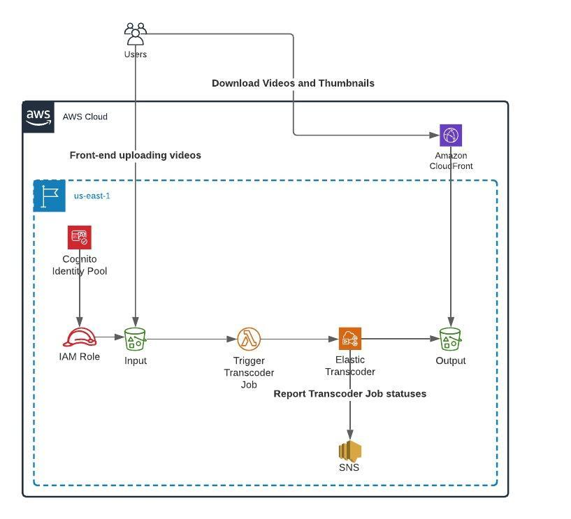

# This directory contains architecture proposal and IaC code for the processing and storing videos for the customer review

## Abstract

The video processing can be resource consuming, so it is preferable to implement this part out of the main backend application. AWS Media processing and Serverless-oriented services can be used to reduce the time needed to develop and manage the solution.

## Architecture

Suggested solution should be considered as Proof-Of-Concept proposal. Performance, monitoring, logging, input validation and security considerations were not priorities for the solution, yet part of them was implemented, IAM access for an example.

* Fronted part of the solution runs in a browser. By using Cognito Identity Pool with unauthenticated access enabled users can upload video to an S3 input bucket. The S3 input bucket has CORS rule configured which allows to upload to S3 only from application domain.
* When video is uploaded to the S3 input bucket, the event notification invokes Lambda function that runs ElasticTranscoder job.
* ElasticTranscoder job processes incoming video: it transforms it according to a predefined preset (720p format by default) and creates a thumbnail and stores generated resources to the S3 output bucket.
* When ElasticTrancoder job finishes the job status is sent to an SNS topic, which can be used to notify application that video is processed and uploaded to the storage.
* A Cloudfront distribution serves processed videos from S3 bucket, protected by using Origin Access Identity.




## IaC templates

The described architecture is implemented using Terraform v0.13. Terraform state is stored locally.

### Prerequisites:

* Terraform 0.13.
* Configured access to an AWS account. It is assumed that full admin access is granted to AWS account.
* The code doesn't depend on the previous tasks and can be run separately.

Please check the [default variables](terraform.tfvars) and adjust it if needed.


### Running:

To review changes:

```sh
terraform plan
```

To apply changes:

```sh
terraform apply -auto-approve
```

The command output contains CloudFormation endpoint, S3 bucket names, and SNS topic ARN that can be used to verify how the code works.

How to verify if the code works:

* log in to AWS Console
* Go to S3 and upload a video file to `assessment-inputXXXXXXXXXXXXXXXXXXX` bucket, the exact name can be found in the output of `terraform apply` or `terraform output`
* Go to S3 and check the output bucket `assessment-outputXXXXXXXXXXXXXXXXXXX`. There should be folder `processed/` containing the processed video and thumbnail. The processed resources will have a generated name, basically random 'uuid' is added.
* The status of the Job will be sent to SNS topic and also can be checked on Elastic Transcoder section of AWS Console.
* The processed video and thumbnail are available via CloudFront distribution, its endpoint can be found in the output of `terraform apply`. Be informed that the CloudFront origin path is 'processed/' so an URI must not include it.

The Transcoder has been tested against `MP4` type of media files.

To destroy resources:

```sh
terraform destroy -auto-approve
```

### Resources:

* A Cognito Identity Pool with an IAM policy allowing the frontend upload files to a S3 bucket.
* A S3 bucket for uploaded videos. It has CORS rule configured, that allows to upload to S3 from a particular domain, by default from "*", which means from anywhere. It also configured to invoke the Lambda function when new objects are uploaded.
* A Lambda function to receive notifications from S3 input bucket and run Transcoder job that will convert an uploaded video to predefined format and create a thumbnail for it.
* An ElasticTranscoder Pipeline to run Video processing jobs.
* A SNS topic to get ElasticTranscoder job statuses.
* A S3 bucket for processed videos and the bucket policy allowing CloudFront get objects from the bucket.
* A CloudFront distribution with Origin Access Identity configured.
