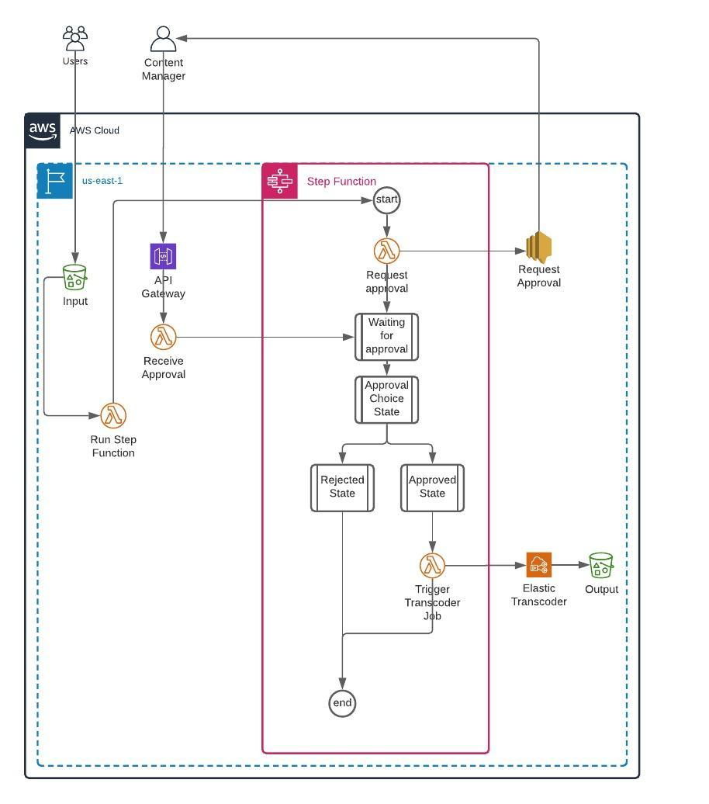

# This directory contains architecture proposal and the required IaC, Lambda, and Step Function code for adding manual approval to processing and storing videos for the customer reviews

## Abstract

This feature requires introducing a task orchestration system. AWS Step Functions allow us to visualize, control, and keep the state of the workflow, while Lambda functions perform smaller tasks.

## Architecture

The solution does not cover uploading and serving videos to and from customers.

The suggested architecture:

* An S3 bucket with event notification configured. When a new object is uploaded it triggers the Lambda function, which task is to run the Step function.
* Step function starts and runs `Request Approval` Lambda function, which sends a message containing a link to the uploaded S3 object and Approval/Reject links to SNS topic. The `Request Approval` Lambda function is run asynchronously. The workflow stops here until the status of the `Request Approval` Lambda function will be received. The status will be updated by another function, invoked by a Content Manager action.
* A content manager receives a message containing the uploaded S3 object, Approval, and Rejection links.
* The Approval and Rejection links are handled by API Gateway that proxies requests to `Receive Approval` Lambda function. The function will update the Step Function with the status and the workflow proceeds with running `Trigger Transcoder Job` Lambda function or ending the workflow depending on which link was invoked.



## IaC templates

The described architecture is implemented using Terraform v0.13. Terraform state is stored locally.

### Prerequisites

* Terraform 0.13.
* Configured access to an AWS account. It is assumed that full admin access is granted to the AWS account.
* The code doesn't depend on the previous tasks and can be run separately.


### Running

Make sure that you are in the task directory.

To review changes:

```sh
terraform plan
```

To apply changes:

```sh
terraform apply -auto-approve
```

The command output contains S3 bucket names, and SNS topic ARN to which upload notification with Approval/Rejection links will be sent

How to verify if the code works:

* log in to AWS Console
* Go to SNS and subscribe to 'Request Approval` SNS topic. The easiest way is to use an email subscription.
* Go to S3 and upload a video file to `assessment-inputXXXXXXXXXXXXXXXXXXX` bucket, the exact name can be found in the output of `terraform apply` or `terraform output`. It should start the workflow.
* Check the notification destination you subscribe to 'Request Approval` SNS topic.
* Follow a link from the notification. The Approval link will make Step Function to invoke a Transcoder job and generate video and thumbnail to the S3 bucket. The Rejection link will stop the Step Function execution.
* Status of Step Function executions can be verified in the Step Function section of AWS Console.

To destroy resources:

```sh
terraform destroy -auto-approve
```

### Resources

* API Gateway, with Lambda non-proxy integration.
* S3 buckets for uploaded and processes videos.
* A Lambda function, which is triggered by S3 uploads and runs Step Function workflow.
* A Lambda function that sends a message containing Approval and Rejection links to the SNS topic. The function blocks Step Function execution until Approval/Rejection is received.
* A Lambda function that triggers a Transcoder job if the approval is received.
* A Lambda function that receives Approval/Rejection requests via API Gateway and resumes Step Function execution.
* An SNS topic to send upload notifications to.

### Lambda Functions code

The Lambda function code is stored in [lambda](./lambda/) directory. They are written in Python and packed with Zip.
